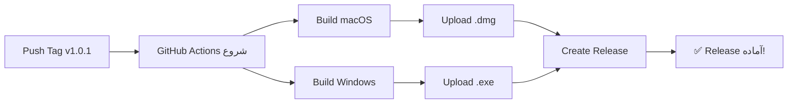

# 🤖 راهنمای GitHub Actions - Build خودکار

این راهنما نحوه استفاده از GitHub Actions برای build خودکار DineSysPro را توضیح می‌دهد.

---

## 🎯 چرا GitHub Actions؟

✅ **خودکار**: بدون نیاز به دسترسی به Windows!  
✅ **رایگان**: برای پروژه‌های public کاملاً رایگان  
✅ **سریع**: build همزمان برای macOS و Windows  
✅ **حرفه‌ای**: مثل پروژه‌های بزرگ!  

---

## 🚀 نحوه استفاده

### روش 1: Release خودکار با Tag

```bash
# 1. به‌روزرسانی نسخه
nano config.json
# "version": "1.0.1"

# 2. Commit و Push
git add .
git commit -m "Release v1.0.1"
git push origin main

# 3. ایجاد Tag
git tag v1.0.1
git push origin v1.0.1

# 🎉 حالا GitHub Actions خودکار:
# - روی macOS build می‌کنه → .dmg
# - روی Windows build می‌کنه → .exe
# - یک GitHub Release می‌سازه
# - فایل‌ها رو آپلود می‌کنه
```

### روش 2: Build دستی (بدون Release)

1. برو به: `https://github.com/Arsam1313/mars_syspro_universal/actions`
2. کلیک روی **"Build and Release"**
3. کلیک روی **"Run workflow"**
4. منتظر بمون تا build تموم شه
5. فایل‌ها رو از **Artifacts** دانلود کن

---

## 📊 جریان کار (Workflow)



---

## 🔍 مشاهده وضعیت Build

### روی GitHub:

1. برو به repository خودت
2. کلیک روی تب **"Actions"**
3. لیست تمام build ها رو می‌بینی
4. کلیک روی هر کدوم برای جزئیات

### Badge در README:

می‌تونی یک badge اضافه کنی که وضعیت build رو نشون بده:

```markdown
[](https://github.com/Arsam1313/mars_syspro_universal/actions)
```

---

## ⏱️ زمان Build

معمولاً:
- **macOS**: 5-10 دقیقه
- **Windows**: 5-10 دقیقه
- **مجموع**: حدود 10-15 دقیقه

---

## 📦 دریافت فایل‌های Build شده

### اگر Tag زدی (Release):
```bash
# فایل‌ها اینجا هستند:
https://github.com/Arsam1313/mars_syspro_universal/releases
```

### اگر دستی build کردی (بدون Release):
1. برو به Actions
2. کلیک روی workflow که اجرا شده
3. بخش **Artifacts** رو پیدا کن
4. دانلود:
   - `DineSysPro-macOS.zip` (شامل .dmg)
   - `DineSysPro-Windows.zip` (شامل .exe)

---

## 🔧 تنظیمات پیشرفته

### تغییر Python Version:

```yaml
- name: Set up Python
  uses: actions/setup-python@v4
  with:
    python-version: '3.12'  # نسخه دلخواه
```

### اضافه کردن Linux Build:

در `.github/workflows/build-release.yml` این job را اضافه کن:

```yaml
build-linux:
  runs-on: ubuntu-latest
  steps:
    - name: Checkout code
      uses: actions/checkout@v3
    
    - name: Set up Python
      uses: actions/setup-python@v4
      with:
        python-version: '3.11'
    
    - name: Install dependencies
      run: |
        pip install -r requirements.txt
        pip install pyinstaller
    
    - name: Build Linux app
      run: python3 build_linux.py  # باید این فایل رو بسازی
    
    - name: Upload Linux artifact
      uses: actions/upload-artifact@v3
      with:
        name: DineSysPro-Linux
        path: dist/*.AppImage
```

---

## 🐛 عیب‌یابی

### مشکل: Build شکست خورد

```bash
# 1. برو به Actions
# 2. کلیک روی build شکست خورده
# 3. لاگ‌ها رو بررسی کن
# 4. خطا رو پیدا کن و fix کن
```

### مشکلات رایج:

**خطا: Missing dependency**
```yaml
# در workflow اضافه کن:
- name: Install system dependencies
  run: |
    sudo apt-get update
    sudo apt-get install -y libxcb-xinerama0  # مثال
```

**خطا: Permission denied**
```bash
# فایل build script رو executable کن:
chmod +x build_macos.py
git add build_macos.py
git commit -m "Make build script executable"
git push
```

---

## 💰 محدودیت‌ها و هزینه

### GitHub Actions Free Tier:

- ✅ **Public repositories**: کاملاً رایگان، بدون محدودیت
- ⚠️ **Private repositories**: 
  - 2,000 دقیقه در ماه رایگان
  - هر build حدود 10-15 دقیقه
  - یعنی حدود 130 build در ماه

### زمان اجرا:
- **Linux**: 1x (1 دقیقه واقعی = 1 دقیقه)
- **macOS**: 10x (1 دقیقه واقعی = 10 دقیقه محاسبه)
- **Windows**: 2x (1 دقیقه واقعی = 2 دقیقه محاسبه)

---

## 📋 Checklist قبل از اولین Release

- [ ] `config.json` نسخه صحیح دارد
- [ ] فایل `.github/workflows/build-release.yml` commit شده
- [ ] Repository روی GitHub push شده
- [ ] Actions در settings repository فعال است
- [ ] Icon فایل‌ها (`icon.icns` و `icon/logo_dinesyspro.ico`) موجودند
- [ ] فایل‌های `ui/` و `sounds/` موجودند
- [ ] `requirements.txt` کامل است

---

## 🎉 مثال کامل Release

```bash
# فرض کن می‌خوای نسخه 1.0.1 رو منتشر کنی:

# 1. به‌روزرسانی کد
git add .
git commit -m "Add new features for v1.0.1"

# 2. به‌روزرسانی نسخه
nano config.json
# "version": "1.0.1"
git add config.json
git commit -m "Bump version to 1.0.1"

# 3. Push
git push origin main

# 4. Tag و Release خودکار
git tag v1.0.1
git push origin v1.0.1

# 5. منتظر بمون (10-15 دقیقه)
# برو به: https://github.com/Arsam1313/mars_syspro_universal/actions

# 6. وقتی build تموم شد، release آماده است:
# https://github.com/Arsam1313/mars_syspro_universal/releases/tag/v1.0.1

# ✅ شامل:
# - DineSysPro-1.0.0-macOS.dmg
# - DineSysPro.exe (یا Setup.exe)
```

---

## 🌟 مزایای این روش

| قبلاً | حالا با GitHub Actions |
|------|------------------------|
| نیاز به سیستم ویندوز 💻 | بدون نیاز! ☁️ |
| build دستی ⌨️ | build خودکار 🤖 |
| 30+ دقیقه زمان ⏰ | 10-15 دقیقه ⚡ |
| احتمال خطا زیاد ❌ | استاندارد و قابل اعتماد ✅ |
| Upload دستی فایل‌ها 📤 | Upload خودکار 🎉 |

---

## 📞 پشتیبانی

اگر مشکلی داشتی:
1. لاگ‌های Actions رو بررسی کن
2. در GitHub Issues سوال بپرس
3. به BUILD_GUIDE.md مراجعه کن

---

## ✅ خلاصه

```bash
# همین! فقط همین!
git tag v1.0.1
git push origin v1.0.1

# بعد 15 دقیقه:
# ✅ macOS build → .dmg
# ✅ Windows build → .exe  
# ✅ Release آماده!
# ✅ کاربران می‌تونن دانلود کنن!
```

---

**🎉 دیگه نیازی به سیستم ویندوز نداری!**

